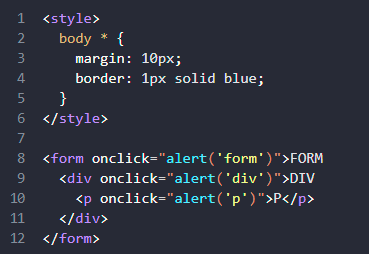
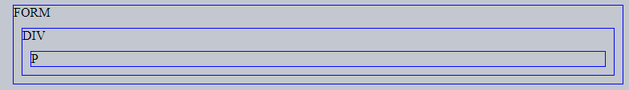
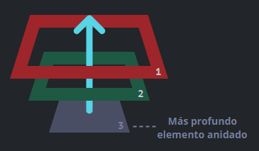
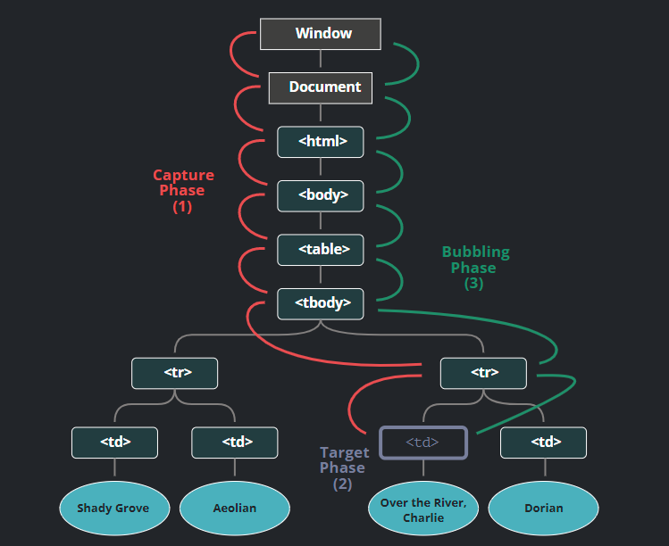

# Proceso de captura y propagación (*bubbling*) de eventos en Javascript
##### Nombre: Mary Cruz Hernandez Alanis
##### No.Control: 18100186

___

## Propoagación
El principio de propagación es simple.

**Cuando un evento ocurre en un elemento, este primero ejecuta los manejadores que tiene asignados, luego los manejadores de su padre, y así hasta otros ancestros.**

Por ejemplo:

Se tienen 3 elementos anidados **FORM > DIV > P** con un manejador en cada uno de ellos:
 

 

Un clic en el elemento del interior `
` primero ejecuta onclick:
- En ese `
 `.
- Luego en el `
` de arriba.
- Luego en el `<form>` de más arriba.
- Y así sucesivamente hasta el objeto `document`.

 

Así, si se hace **clic en `
`**, entonces **se verá 3 alertas: `p → div → form`.** Si se hace clic en `
 se verán 2 alertas: `div → form`.

Este proceso se conoce como **“propagación”** porque **los eventos “se propagan” desde el elemento más al interior, a través de los padres**, como una burbuja en el agua.

----
:warning: **Casi todos los elementos se propagan.**
La palabra clave en esta frase es “casi”.

Por ejemplo, un evento focus no se propaga, entre otro. Pero aún así, esta es la excepción a la regla, la mayoría de eventos sí se propagan.

----

## Detener la propagación
Una propagación de evento empieza desde el elemento objetivo hacia arriba. Normalmente este continúa hasta `<html>` y luego hacia el objeto `document`, algunos eventos incluso alcanzan `window`, llamando a todos los manejadores en el camino.

Pero cualquier manejador podría decidir que el evento se ha procesado por completo y detener su propagación.

El método para esto es `event.stopPropagation()`.

Por ejemplo, body.onclick no funcionará si se hace clic en `<button>`:

~~~
<body onclick="alert(`No se propagó hasta aquí`)">
  <button onclick="event.stopPropagation()">Haz clic</button>
</body>
~~~

---
#### :heavy_exclamation_mark: **`event.stopImmediatePropagation()`**
Si un elemento tiene múltiples manejadores para un solo evento, aunque uno de ellos detenga la propagación, los demás aún se ejecutarán.

En otras palabras, `event.stopPropagation()` detiene la propagación hacia arriba, pero todos los manejadores en el elemento actual se ejecutarán.

Para detener la propagación y prevenir que los manejadores del elemento actual se ejecuten, hay un método `event.stopImmediatePropagation()`. Después de él, ningún otro manejador será ejecutado.

---

---
#### :warning: ¡No detengas la propagación si no es necesario!
La propagación es conveniente. No se debe detener sin una necesidad real, obvia y arquitectónicamente bien pensada.

A veces `event.stopPropagation()` crea trampas ocultas que luego se convierten en problemas.

---

## Captura
Hay otra fase en el procesamiento de eventos llamada “captura”. Es raro usarla en código real, pero a veces puede ser útil.

El estándar de eventos del **DOM** describe 3 fases de la propagación de eventos:

- Fase de captura – el evento desciende al elemento.
- Fase de objetivo – el evento alcanza al elemento.
- Fase de propagación – el evento se propaga hacia arriba del elemento.

Imagen de un clic en `<td>` dentro de una tabla, tomada desde la especificación:

Se explica así: por un clic en `<td>` el evento va primero a través de la cadena de ancestros hacia el elemento (fase de captura), luego alcanza el objetivo y se desencadena ahí (fase de objetivo), y por último va hacia arriba (fase de propagación), ejecutando los manejadores en su camino.

Antes solo se habló de la propagación porque la fase de captura es raramente usada. Normalmente es 
"invisible".

Los manejadores agregados usando la propiedad `on<event>` ó usando atributos HTML ó `addEventListener(event, handler)` con dos argumentos no ejecutarán la fase de captura, únicamente ejecutarán la 2da y 3ra fase.

Para atrapar un evento en la fase de captura, se necesita preparar la opción `capture` como `true` en el manejador:

~~~
elem.addEventListener(..., {capture: true})
// o, solo "true" es una forma más corta de {capture: true}
elem.addEventListener(..., true)

~~~

Hay dos posibles valores para la opción capture:

- Si es `false` (por defecto), entonces el manejador es preparado para la fase de propagación.
- Si es `true`, entonces el manejador es preparado para la fase de captura.

Es de notar que mientras formalmente hay 3 fases, la 2da fase (“la fase de objetivo”: el evento alcanzó el elemento) no es manejada de forma separada; los manejadores en ambas fases, la de captura y propagación, se disparan en esa fase.

Ejemplo de fases, captura y propagación, en acción:
~~~

<form>FORM
  
DIV
    
P

  

</form>

~~~

El código prepara manejadores de clic en cada elemento en el documento para ver cuáles están funcionando.

Si se hace clic en `
`, se verá que la secuencia es:

- `HTML → BODY → FORM → DIV` (fase de captura, el primer detector):
- `P` (fase de objetivo, se dispara dos veces, tan pronto como preparemos los dos detectores: de captura y propagación)
- `DIV → FORM → BODY → HTML` (fase de propagación, el segundo detector).

Hay una propiedad `event.eventPhase` que dice el número de fase en la qué el evento fue capturado. Pero es raramente usada, ya que usualmente se sabe en el manejador.

##### Bibliografía: [Propagación y captura](https://es.javascript.info/bubbling-and-capturing)